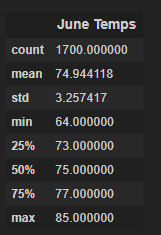

# Surf’s Up: analyzing weather trends in Hawaii for a surf shop

## Overview
My dream retirement gig is opening a shop that sells surfing equipment and ice cream in Hawaii. W. Avy is willing to financially back this idea but has concerns about the weather. We have addressed the concerns involving rain; however, the investor is still concerned about viability in temperature over the course of the year. He would like to compare temperatures in June to December to determine if profits can be made year-round.

## Results
### Statistics
**Table 1:** Statistics for temperatures in June.

**Table 2:** Statistics for temperatures in December.

### Major Points
- The difference in the average temperature between June and December is slight. (June: 75 degrees, December: 71 degrees).
- The minimum temperature for December is palpably cooler than the minimum temperature in June (June: 64 degrees, December: 56 degrees).
- There is minor difference in the quartiles between June and December, with December being slightly colder.
- The standard deviation in December is greater than in June, meaning there are greater variations throughout the month.

## Summary
Overall, it looks like the surf portion business should not be affected too badly in December. Decembers in Hawaii are still quite warm. Despite lower summary stats throughout, I do not believe the difference is significant enough to be a deterrent to surf minded clientele. However, we are in the ice cream business as well. (1) We need to understand at what temperature it becomes a deterrent to buy ice cream. We do not have data on what temperature causes a loss of desire for ice cream, but we could set an arbitrary threshold of 75 degrees and figure out what percentage of days each month has exceeding that. This could be extrapolated into how successful the ice cream business would be that month. (2) We should also compare the amount of rain between June and December to see if there is more rain at the beginning of winter, causing slower business.
